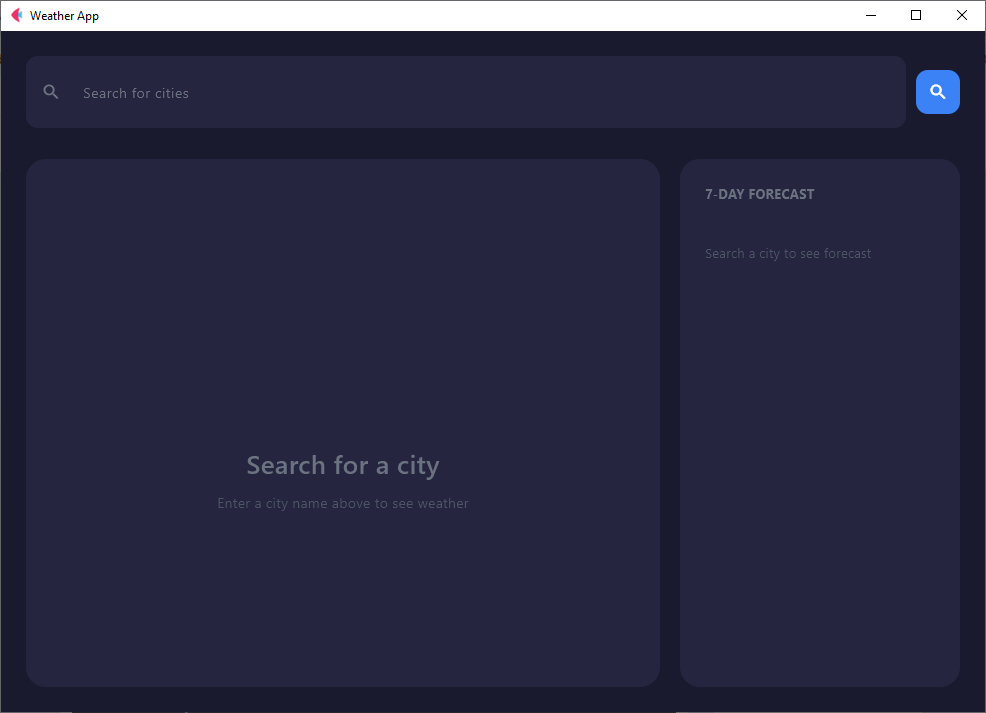
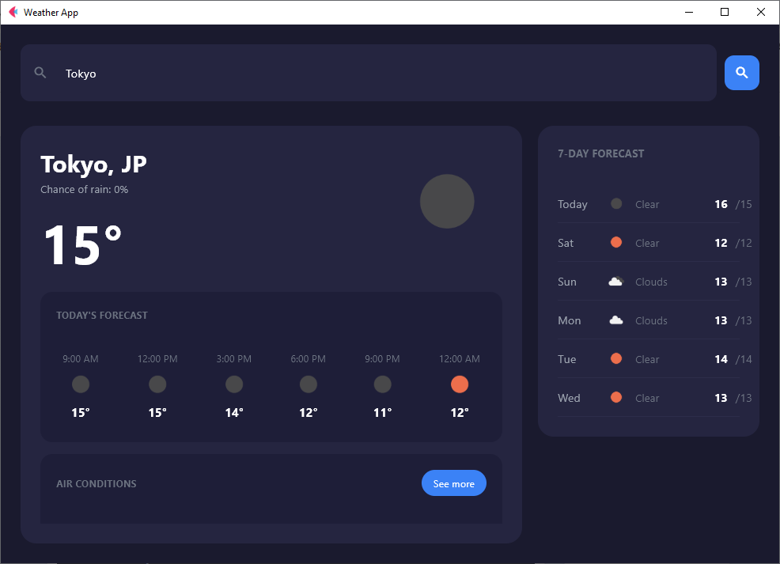
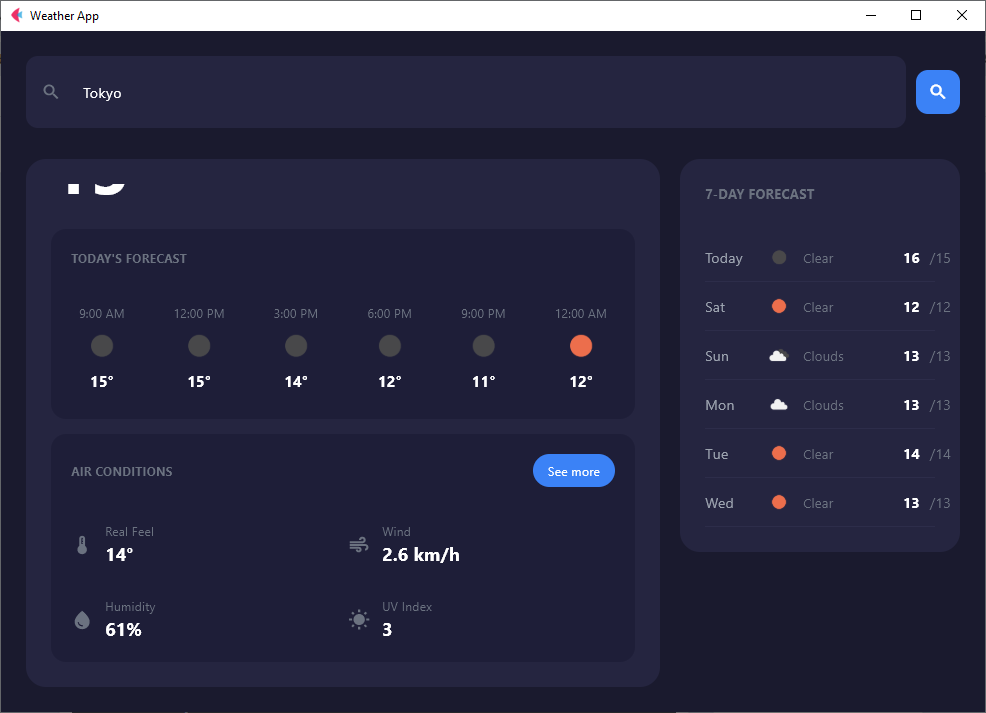

# Weather Application - Module 6 Lab

## Student Information
- **Name**: Rona Mae M. Quite
- **Student ID**: 231002336
- **Course**: CCCS 106 - Application Development and Emerging Technologies
- **Section**: BSCS 3A

## Project Overview
A modern weather application built with Python and the Flet framework that provides real-time weather information and forecasts for cities worldwide. The application features a sleek dark theme design with comprehensive weather details, hourly forecasts, and a 7-day outlook displayed in an intuitive interface.

## Features Implemented

### Base Features ✅
- [x] City search functionality with real-time results
- [x] Current weather display (temperature, description, weather icon)
- [x] Dynamic weather icons from OpenWeatherMap API
- [x] Detailed weather metrics (Real Feel, Wind, Humidity, UV Index)
- [x] Error handling for invalid cities and network issues
- [x] Modern dark theme UI design
- [x] Proper async operations using `page.run_task()`
- [x] Professional layout with organized information panels

### Enhanced Features ✨

#### 1. **Hourly Weather Forecast (Today's Forecast)**
**Description:**  
Displays a 6-hour forecast preview showing weather conditions throughout the day. Each time slot shows the hour (9:00 AM, 12:00 PM, etc.), weather icon, and temperature in Celsius. This gives users a detailed view of how weather will change throughout the current day.

**Why I chose this feature:**  
- Provides granular weather information beyond just current conditions  
- Helps users plan their day based on hourly temperature changes  
- Demonstrates ability to parse and display time-series weather data  
- Shows understanding of data visualization and user experience design  

**Challenges faced:**  
- Parsing the forecast API to extract hourly data points  
- Converting UTC timestamps to local time zones  
- Displaying 6 distinct time slots in a clean, horizontal layout  
- Ensuring icons and temperatures align properly with time labels  
- Handling edge cases where forecast data might be incomplete  

**How I solved them:**  
- Used OpenWeatherMap's forecast API which provides 3-hour interval data  
- Implemented datetime parsing to extract and format time stamps (e.g., "9:00 AM")  
- Created a horizontal scrollable row to display all time slots  
- Used Flet's Row component with proper spacing and alignment  
- Added error handling to gracefully manage missing data points  
- Cached the forecast data to avoid repeated API calls

#### 2. **7-Day Weather Forecast Panel**

**Description:**  
A comprehensive weekly forecast displayed in a dedicated side panel. Each day shows the day of week (Today, Sat, Sun, etc.), weather icon, description (Rain, Clouds), and high/low temperatures. This provides users with a complete week's weather outlook at a glance.

**Why I chose this feature:**  
- Essential feature for any weather application  
- Demonstrates multi-day data aggregation and processing  
- Shows proficiency in creating complex, data-driven UI components  
- Provides genuine practical value for trip planning and weekly schedules  
- Displays mastery of API integration with multiple data points  

**Challenges faced:**  
- OpenWeatherMap forecast API returns 40 data points (every 3 hours for 5 days)  
- Needed to aggregate hourly data into daily summaries  
- Extracting daily high/low temperatures from multiple readings  
- Determining representative weather condition for each day  
- Formatting dates to show "Today", day names, and maintaining proper order  
- Creating a visually balanced layout that doesn't overwhelm the main display  

**How I solved them:**  
- Implemented data grouping algorithm to organize forecasts by date  
- Calculated daily max/min temperatures from all readings for that day  
- Selected the most frequent weather condition as the representative icon  
- Used Python's `datetime` module for proper date parsing and formatting  
- Created conditional logic to display "Today" for current day, then day names  
- Designed a fixed-width side panel with consistent card heights  
- Added scrolling support for longer forecast lists

### Additional Features

#### Air Conditions Panel
A dedicated information panel showing detailed atmospheric conditions:

- **Real Feel**: Apparent temperature accounting for humidity and wind  
- **Wind**: Current wind speed in km/h  
- **Humidity**: Relative humidity percentage  
- **UV Index**: Sun exposure level for skin protection planning  

**Implementation:**  
Displays in a clean grid format below the current weather, pulling data from OpenWeatherMap's current weather endpoint. Uses intuitive icons for each metric to enhance readability.

## Screenshots

### 🟦 Initial Screen (before searching)


---

### Weather Results – Manila


---

### Weather Details (Forecast + Air Conditions)


---

## Other Countries 

### 🇯🇵 Tokyo Weather


### 🇯🇵 Tokyo Weather Details (Forecast + Air Conditions)


## Installation

### Prerequisites
- Python 3.8 or higher
- pip package manager
- OpenWeatherMap API key (free)

### Setup Instructions

```bash
# Clone the repository
git clone https://github.com/chan-del/cccs106-projects.git
cd cccs106-projects/mod6_labs

# Create virtual environment
python -m venv venv

# Activate virtual environment
# Windows:
venv\Scripts\activate
# macOS/Linux:
source venv/bin/activate

# Install dependencies
pip install -r requirements.txt

# Create .env file and add your API key
cp .env.example .env

# Run the application
python main.py
```
## Usage

1. Run the app:
```bash
python main.py
```
2. Type any city (Manila, Tokyo, etc.)
   - View real-time weather
   - View hourly forecast
   - View 7-day forecast

## Dependencies
```txt
flet==0.28.3
httpx>=0.27.0
python-dotenv>=1.0.0
```

## Code & Implementation

### Code Overview
- **config.py** – Manages app settings and API keys. Validates that `OPENWEATHER_API_KEY` exists.
- **main.py (WeatherApp)** – Handles UI, search, and data display. Includes inline comments and docstrings for clarity.
- **weather_service.py** – Fetches weather & forecast data from OpenWeatherMap. Handles errors like invalid cities, network issues, and API failures.

**Examples of inline comments:**

```bash
# Load search history from JSON file
def load_history(self):
    if self.history_file.exists():
        with open(self.history_file, 'r') as f:
            return json.load(f)
    return []

# Fetch weather asynchronously
async def fetch_weather(self):
    """Fetch weather and forecast for the entered city."""
```

## Challenges & Learnings

- **Async Programming** – I learned I had to use `page.run_task()` so the app wouldn’t freeze while fetching weather data.  
- **API Data Parsing** – The forecast API gave 3-hour intervals, so I grouped them into hourly and daily summaries for a cleaner display.  
- **UI Design** – I focused on making a dark theme that’s readable, with good contrast, spacing, and layout.  
- **State Management** – I made the search history save in a JSON file so it remembers the last 5 cities even after restarting the app.  
- **Error Handling** – I added proper exception handling so users see friendly messages instead of the app crashing.


