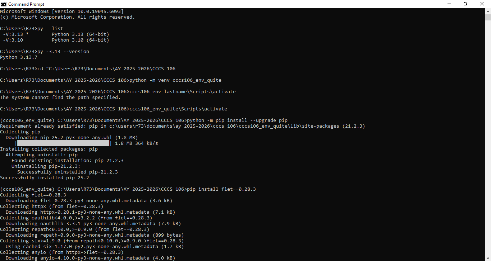
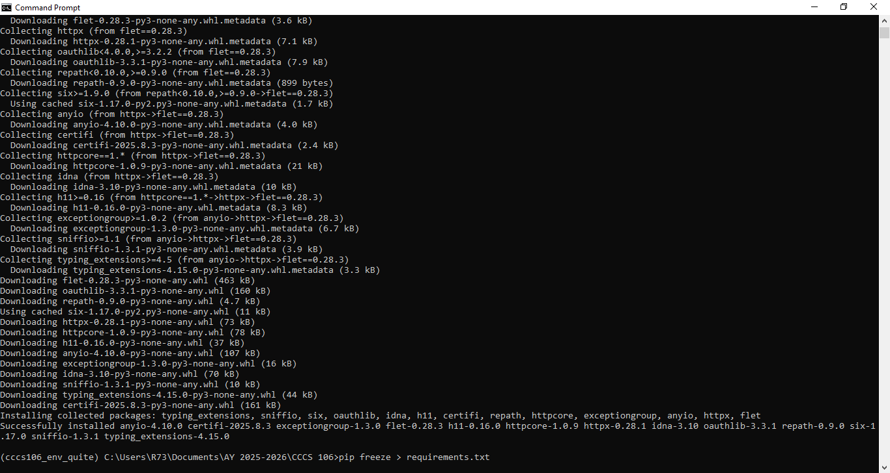
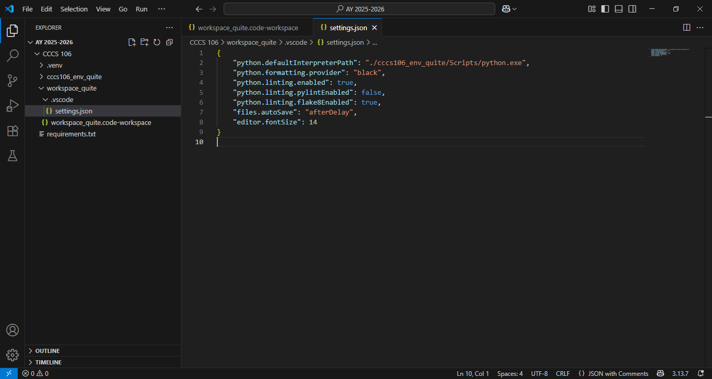
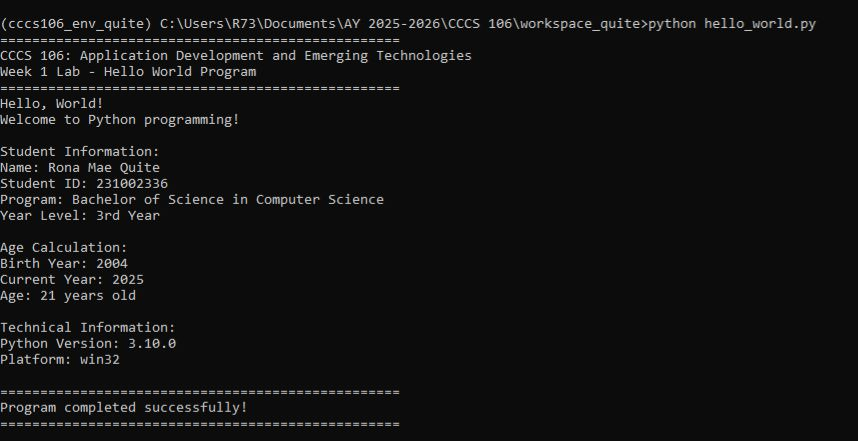
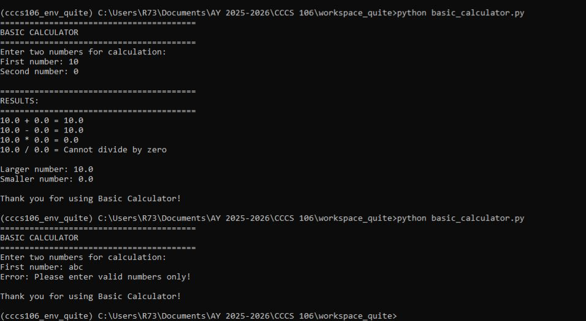

# Lab 1 Report: Environment Setup and Python Basics

**Student Name:** Rona Mae M. Quite
**Student ID:** 231002336 
**Section:** BSCS-3A  
**Date:** August 30, 2025  

## Environment Setup

### Python Installation
- **Python Version:** 3.13.0  
- **Installation Issues:** Initially, `python --version` showed 3.10, solved by updating PATH to point to Python 3.13.  
- **Virtual Environment Created:** ✅ cccs106_env_quite  

### VS Code Configuration
- **VS Code Version:** 1.82.0  
- **Python Extension:** ✅ Installed and configured  
- **Interpreter:** ✅ Set to `cccs106_env_quite/Scripts/python.exe`  

### Package Installation
- **Flet Version:** 0.28.3  
- **Other Packages:** None  

## Programs Created

### 1. hello_world.py
- **Status:** ✅ Completed  
- **Features:** Student info display, age calculation, system info  
- **Notes:** Had to double-check file path to make sure script was inside `week1_labs/`.  

### 2. basic_calculator.py
- **Status:** ✅ Completed  
- **Features:** Basic arithmetic, error handling, min/max calculation  
- **Notes:** Tested with invalid input and division by zero.  

## Challenges and Solutions
- **Problem:** Command Prompt still used Python 3.10 by default.  
- **Solution:** Updated PATH to use Python 3.13.  
- **Problem:** Running `hello_world.py` gave "file not found".  
- **Solution:** Moved the file into the correct folder `week1_labs/`.  

## Learning Outcomes
- Learned how to properly configure Python and VS Code for a course project.  
- Gained hands-on practice with creating a virtual environment.  
- Understood how to handle errors (e.g., invalid inputs, division by zero) in Python programs.  

## Screenshots

