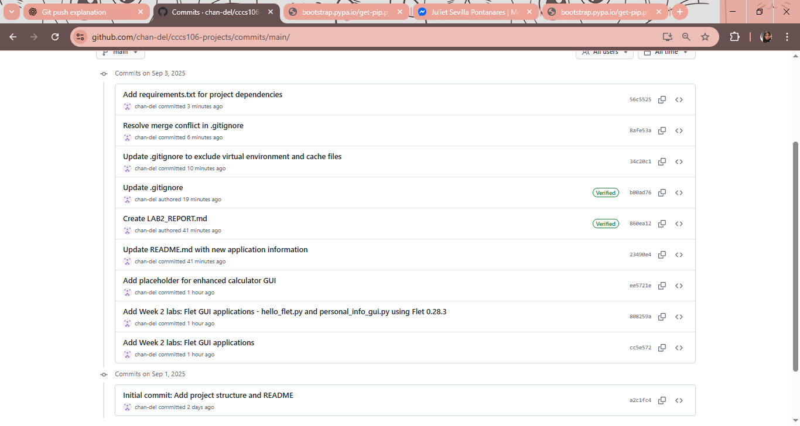
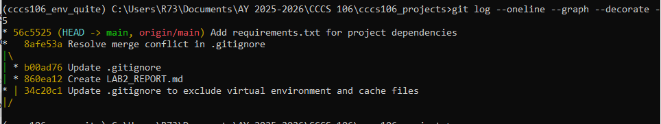
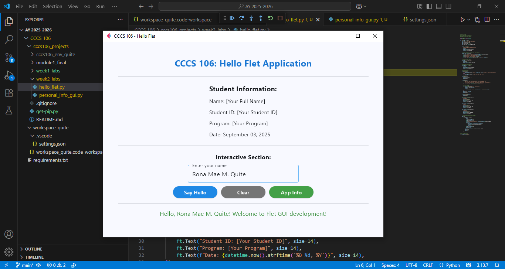
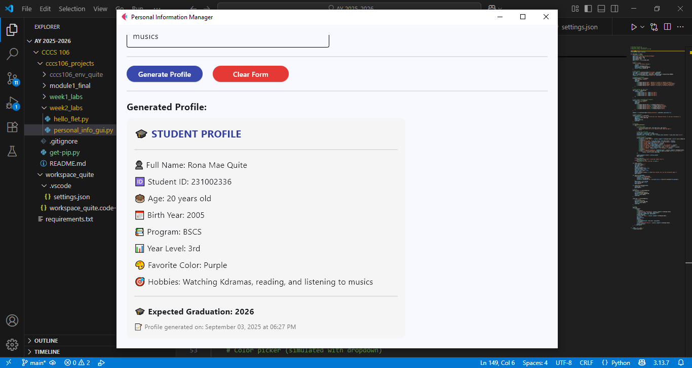
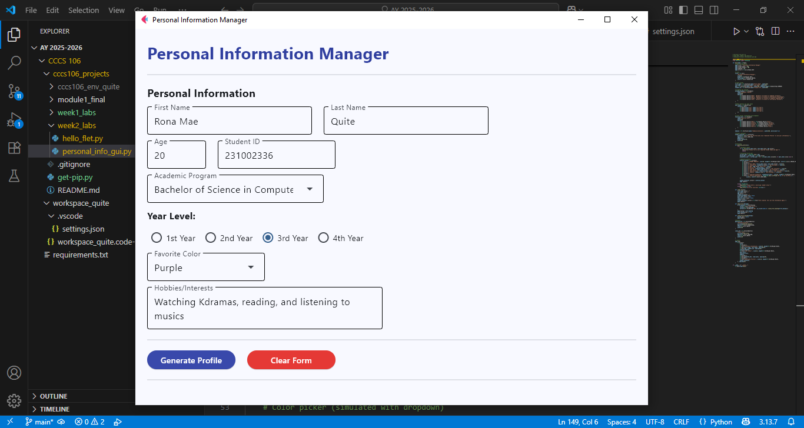

# Lab 2 Report: Git Version Control and Flet GUI Development

**Student Name:** Rona Mae M. Quite  
**Student ID:** 231002336  
**Section:** BSCS 3A  
**Date:** September 3, 2025  

---

## Git Configuration

### Repository Setup
- **GitHub Repository:** [https://github.com/chan-del/cccs106-projects](https://github.com/chan-del/cccs106-projects)  
- **Local Repository:** ✅ Initialized and connected  
- **Commit History:** Multiple commits with descriptive messages (see screenshots below)  

### Git Skills Demonstrated
- ✅ Repository initialization and configuration  
- ✅ Adding, committing, and pushing changes  
- ✅ Branch creation, merging, and deletion  
- ✅ Remote repository management with GitHub  

---

## Flet GUI Applications

### 1. hello_flet.py
- **Status:** ✅ Completed  
- **Features:** Interactive greeting, student info display, dialog boxes  
- **UI Components:** `Text`, `TextField`, `Button`, `Dialog`, `Container`  
- **Notes:** Smooth implementation, tested successfully  

### 2. personal_info_gui.py
- **Status:** ✅ Completed  
- **Features:** Form inputs, dropdowns, radio buttons, profile generation  
- **UI Components:** `TextField`, `Dropdown`, `RadioGroup`, `Container`, scrolling layout  
- **Error Handling:** Includes input validation and user feedback  
- **Notes:** Works as expected, profile generation successful  

---

## Technical Skills Developed

### Git Version Control
- Understanding of repository setup and remote syncing  
- Basic Git workflow (`add`, `commit`, `push`)  
- Branch management (create, merge, delete)  
- Conflict resolution and remote collaboration  

### Flet GUI Development
- Mastery of Flet 0.28.3 syntax and components  
- Layout management using containers and responsive design  
- Event handling for interactive features  
- Error handling and user-friendly interfaces  

---

## Challenges and Solutions
- **Merge Conflict in `.gitignore`:** Resolved by manually editing the file and committing the correct version.  
- **Virtual Environment in Git:** Initially tracked by Git, but later excluded using `.gitignore`.  

---

## Learning Outcomes
- Gained hands-on experience with **Git branching and merging**.  
- Learned how to build **cross-platform GUI apps** using Flet.  
- Understood the importance of **clear commit messages** and version control discipline.  
- Improved ability to debug and handle errors in both Git and Python GUI development.  

---

## Screenshots

### Git Repository
-   
-   

### GUI Applications
-   
-   
-   

---

## Future Enhancements
- Add more advanced GUI components (e.g., tabs, navigation menus).  
- Implement data persistence (save/load user info).  
- Explore connecting the GUI apps to a database for extended functionality.  
